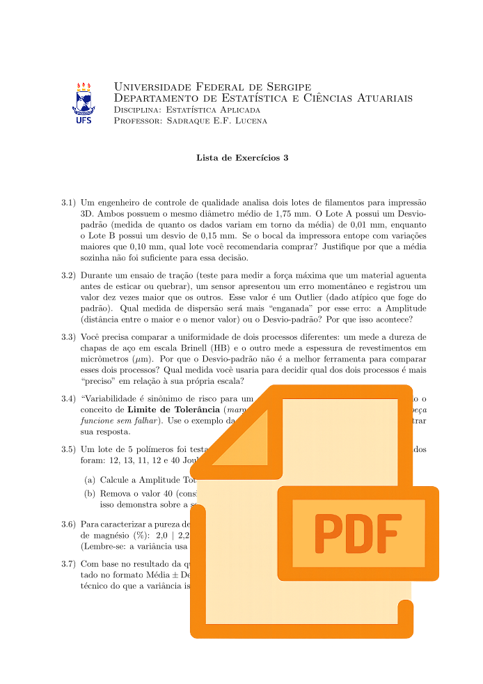
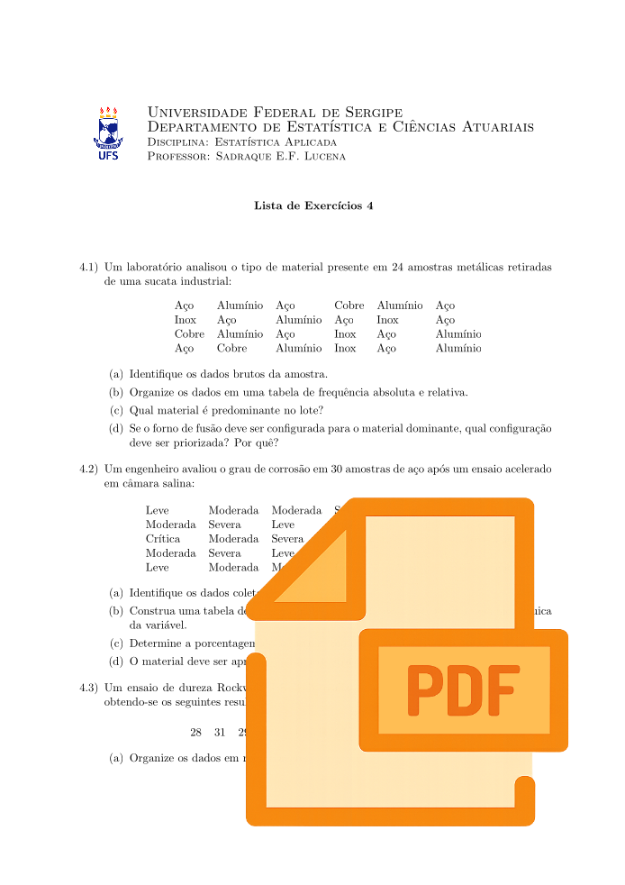

A prática é a chave para o domínio da Probabilidade. Aqui estão as listas de exercícios, organizadas para acompanhar o conteúdo da disciplina e ajudar você a consolidar o conhecimento. Utilize-as como sua principal ferramenta de estudo; elas são o melhor caminho para o sucesso nas avaliações.

## Parte 1: Introdução à Probabilidade

::: {.grid}

::: {.g-col-12 .g-col-md-4}
<a href="EstatAplicada_lista1.pdf" target="_blank" style="text-decoration: none; color: inherit;">
 Lista 1
</a>
:::

::: {.g-col-12 .g-col-md-4}
<a href="EstatAplicada_Lista2.pdf" target="_blank" style="text-decoration: none; color: inherit;">
 Lista 2
</a>
:::

::: {.g-col-12 .g-col-md-4}
<a href="EstatAplicada_Lista3.pdf" target="_blank" style="text-decoration: none; color: inherit;">
 Lista 3
</a>
:::

::: {.g-col-12 .g-col-md-4}
<a href="EstatAplicada_Lista4.pdf" target="_blank" style="text-decoration: none; color: inherit;">
 Lista 4
</a>
:::

:::
