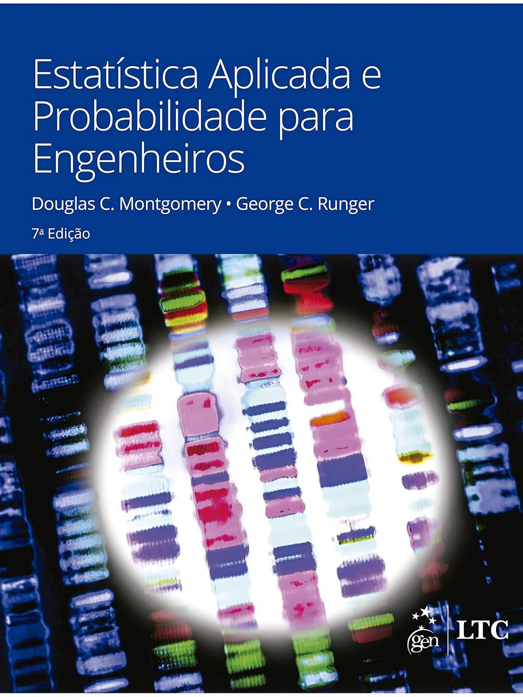
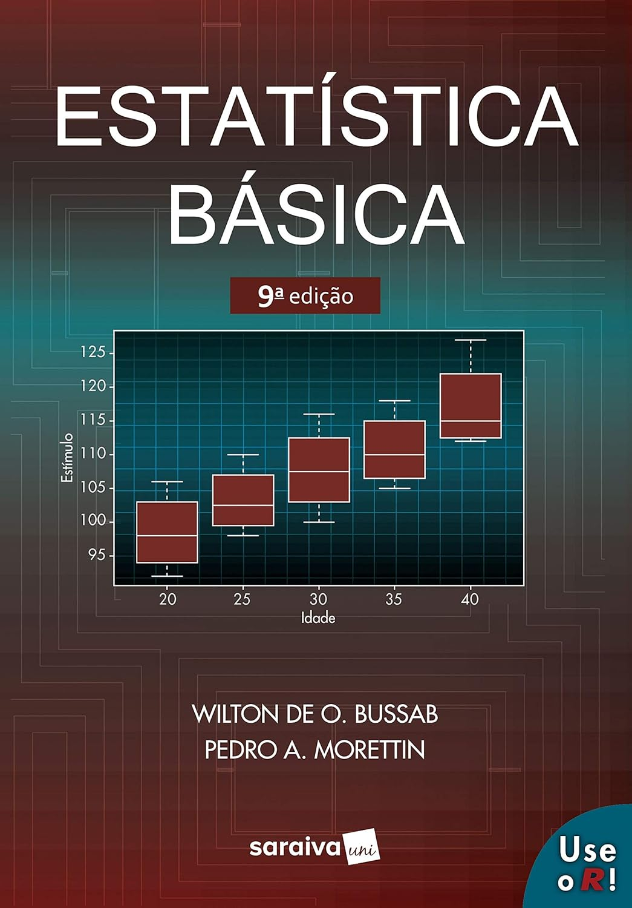
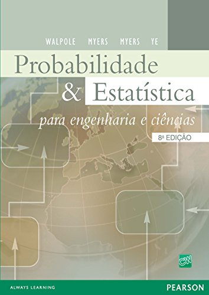

## Canais de Comunicação e Materiais da Disciplina

- Site: <http://sadraquelucena.github.io/estat-aplicada>

- Grupo no WhatsApp: <http://tiny.cc/eawpp>

{fig-align="center"}

---

## Informações da disciplina

- **Componente curricular:** ESTAT0011 -- Estatística Aplicada
- **Vagas Reservadas:** Engenharia de Materiais
- **Carga horária:** 60 horas (4 créditos)
- **Horário:**
  - Terças -- 17h00 às 18h30
  - Quintas -- 17h00 às 18h30
- **Docente:** Prof. Dr. Sadraque E. F. Lucena

---

## Objetivos

- Proporcionar experiências de aprendizagem que permitam ao estudante familiarizar-se com conhecimentos estatísticos fundamentais para a análise, interpretação e solução de problemas cotidianos e aplicados.

---

## Ementa

- Regras elementares de probabilidade.
- Distribuição binomial, Poisson e normal.
- População e amostras.
- Testes de bondade de ajustamento.
- Uso de transformações.
- Distribuições de certas estatísticas amostrais.
- Noções de testes e hipóteses.
- Noções de delineamento experimental.
- Experimentos com um e dois fatores.
- Regressão e correlação.

---

## Conteúdo programático

1. Estatística Descritiva e Confiabilidade de Dados

    1.1. As fases do trabalho estatístico e classificação de variáveis em engenharia;
    
    1.2. Séries estatísticas e representação tabular e gráfica (Histogramas e Boxplots);
    
    1.3. Distribuição de frequências simples e em classes;
    
    1.4. Medidas de Posição: Média, Mediana e Moda;
    
    1.5. Medidas de Dispersão: Variância, desvio-padrão e coeficiente de variação (CV);
    
    1.6. Erros de medição e tratamento de valores atípicos (*outliers*).

---

## Conteúdo programático

2.  Probabilidade e Modelagem de Fenômenos

    2.1. Conceitos de probabilidade: Experimento aleatório, espaço amostral e eventos;
    
    2.2. Probabilidade condicional e Teorema de Bayes aplicado a ensaios não destrutivos;
    
    2.3. Variáveis aleatórias, esperança matemática e variância;
    
    2.4. Distribuições discretas: Bernoulli, Binomial e Poisson (defeitos por unidade de área);
    
    2.5. Distribuições contínuas: Uniforme, Exponencial e Normal;
    
    2.6. Padronização (Z) e tabelas de probabilidade.

---

## Conteúdo programático

3. Inferência Estatística e Tomada de Decisão

    3.1. Noções de amostragem e erro padrão;
    
    3.2. Distribuições amostrais da média e da proporção;
    
    3.3. Intervalo de confiança para média e proporção;
    
    3.4. Testes de hipóteses: Conceitos, erro tipo I e erro tipo II;
    
    3.5. Teste t de Student para comparação de médias (amostras independentes e pareadas);
    
    3.6. Testes de bondade de ajuste (testes de normalidade).

---

## Conteúdo programático

4. Delineamento Experimental (ANOVA) e Modelagem

    4.1. Análise de Variância (ANOVA) com um fator: Experimentos completamente casualizados;
    
    4.2. Análise de Variância (ANOVA) com dois fatores e interação;
    
    4.3. Tipos de correlação e Coeficiente Linear de Pearson;
    
    4.4. Regressão Linear Simples: Estimativa de parâmetros e interpretação física;
    
    4.5. Coeficiente de determinação ($R^2$) e análise de resíduos.

---

## Conteúdo programático

5. Tópicos Especiais de Engenharia de Materiais

    5.1. Introdução à Distribuição de Weibull;
    
    5.2. Linearização da função de Weibull via logaritmos;
    
    5.3. Determinação do Módulo de Weibull ($m$) para análise de confiabilidade de materiais frágeis.

---

## Bibliografia Recomendada

::: {.columns}
::: {.column width="33%"}

:::
::: {.column width="33%"}

:::
::: {.column width="33%"}

:::
:::

---

## Metodologia

- 2 encontros semanais, com 90 minutos de aula presencial cada
- 30 minutos de atividades extraclasse (hora-trabalho) para cada aula, indicadas pelo docente

---

## Datas Importantes

### Avaliações

- **Avaliação 1:** 07/05/2026 (quinta)
- **Avaliação 2:** 11/06/2026 (quinta)
- **Avaliação 3:** 16/07/2026 (quinta)
- **Avaliação Repositiva:** 21/07/2026 (terça)

### Não haverá aula

- **02/04/2026:** Quinta-feira santa (recesso acadêmico)
- **21/04/2026:** Tiradentes (feriado nacional)
- **04/06/2026:** Corpus Christi (recesso acadêmico)
- **23/06/2026:** Véspera de São João (recesso acadêmico)

# Conceitos Iniciais

---

## População vs. Amostra
 

### População

- Consiste de todas as unidades de interesse.
- Quando os dados coletados são da população, chamamos o procedimento de coleta de **censo**.
- Qualquer característica numérica de uma população é chamada de **parâmetro**.

---

## População vs. Amostra
 

### Amostra

- Qualquer subconjunto da população.
- Usada para fazer inferências sobre a população.
- Quando os dados coletados são de uma amostra, o procedimento de coleta é chamado de **amostragem**.
- Qualquer medida calculada a partir da amostra é chamada de **estatística**.

---

## Tipos de Variáveis

### Qualitativas

- São variáveis que consistem em atributos, classificações ou registros não numéricos.
- **Exemplos:** Tipo de tratamento térmico (têmpera, recozimento, normalização), Presença de defeito (sim / não)

### Quantitativas

- São variáveis que correspondem a medidas ou contagens numéricas.
- **Exemplos:** Teor de carbono (%), Espessura de revestimento (µm)

---

## Variáveis Qualitativas
 

### Nominais

- Os dados que representam um conjunto de possíveis categorias e não possuem ordem.
- **Exemplos:**
    - Tipo de polímero (PE, PP, PVC, PET)
    - Método de ensaio (tração, impacto, dureza)
    - Fornecedor de minério (Vale, CSN Mineração)
- Um caso especial são os dados **binários**, que possuem apenas duas categorias de valores (0/1, verdadeiro/falso).

---

## Variáveis Qualitativas
 

### Ordinais

- Dado categórico que tem uma ordem explícita.
- **Exemplos:**
    - Classificação de dureza (Escala Mohs): 1- Extremamente macio a 10- Dureza máxima
    - Nível de oxidação (Baixo, Médio, Alto)
    - Classificação de acabamento superficial (ruim, regular, bom, excelente)

---

## Variáveis Quantitativas
 

### Discretas

- Podem assumir apenas valores inteiros, como contagens.
- **Exemplos:** Número de trincas em uma amostra, Número de peças produzidas por lote

### Contínuas

- Podem assumir qualquer valor em um intervalo.
- **Exemplos:** Temperatura de tratamento térmico (°C), Resistência à tração (MPa)

---

## Exemplo

Classifique as variáveis abaixo:

1. Tipo de liga metálica (ex: Aço 1020, Inox 304)
2. Número de microtrincas por cm² em uma cerâmica
3. Temperatura de sinterização em °C (ex: 1250.5°C)
4. Classificação de resistência ao impacto (Ruim < Regular < Bom)
5. Quantidade de fases presentes na microestrutura
6. Alongamento percentual após ensaio de tração (ex: 12.4%)
7. Tipo de fratura observada (Dúctil ou Frágil)
8. Rugosidade superficial (Ra) medida em micrômetros
9. Nível de pureza do reagente (Técnico < Analítico < Ultrapuro)

# Fim