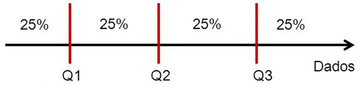
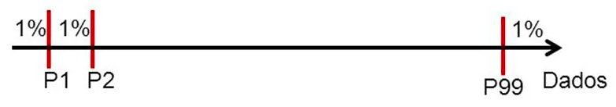

## Introdução

- Na Engenharia de Materiais, é comum realizar experimentos repetidas vezes para caracterizar as propriedades de um material.
- Isso ocorre porque os dados possuem variabilidade natural, erros de medição, impurezas nas amostras e comportamentos inesperados.
- Por isso, faz mais sentido analisar o comportamento de um conjunto de corpos de prova do que para um único teste.
- No entanto, para compreendermos melhor, precisamos resumir as informações coletadas.

---

## Introdução

- Como podemos resumir milhares de medições de laboratório em indicadores que permitam uma **tomada de decisão** técnica segura e econômica?
- As **Medidas de Posição** (ou de Tendência Central) são os nossos primeiros instrumentos de navegação para identificar onde a maioria dos dados "se localiza".
- Tipos de informações essenciais que podemos extrair:

    - **O Equilíbrio:** Onde está o centro de massa? (Média)
    - **A Ordem:** Qual valor divide o lote ao meio? (Mediana)
    - **O Padrão:** O que mais se repete no processo? (Moda)
    - **As Fronteiras:** Onde estão os 25% melhores ou piores? (Separatrizes)

---

## Introdução

#### Exemplo

- Imagine que você precisa decidir se um lote de polímero para próteses médicas deve ser aprovado ou descartado. Diante de muitos valores obtidos nas medições, é necessário resumir essas informações em números representativos para facilitar a análise. A **média** cumpre esse papel ao indicar um valor geral do conjunto, mas existem também outras medidas, como a mediana e a moda, que oferecem diferentes perspectivas sobre a distribuição e tornam a decisão mais confiável.

#### Atenção!

- Não foquem no cálculo (a calculadora faz isso).
- Foquem no sentido: por que uma medida é melhor que outra para cada tipo de problema?

# Média Aritmética

(Um resumo do comportamento do material)

---

## Por que calcular a média?

Suponha que em um laboratório, uma engenheira está avaliando a **resistência à tração** (*tensão máxima que o material suporta antes de romper*) de um polímero usado em engrenagens. Cada peça testada pode apresentar valores ligeiramente diferentes devido a:

- pequenas impurezas no material
- defeitos microscópicos
- pequenas variações no processo de fabricação

#### Pergunta

Se medirmos várias peças de um mesmo lote e obtivermos valores diferentes, **como resumir todo esse comportamento em um único número representativo?**

---

## Média Aritmética

- A média aritmética é a soma de todos os valores observados dividida pelo número total de observações.

- Se observarmos $n$ valores de uma variável $X$, isto é, $X_1, X_2, \ldots, X_n$, a média amostral (denotada por $\overline{X}$) é dada por
$$ \overline{X}=\frac{\sum_{i=1}^{n}X_i}{n} $$

- A média amostral é uma **estimativa da média real da população**.

- A média populacional é representada por $\mu$.

---

## Interpretação Física da Média

- Uma forma intuitiva de entender a média é imaginar um centro de massa.
- Se colocarmos todos os valores sobre uma régua, a média seria o ponto onde a régua **se equilibraria**.
- Essa interpretação é útil porque mostra que:
    - valores maiores puxam a média para cima
    - valores menores puxam a média para baixo

---

## Exemplo 2.1

Um laboratório está avaliando a resistência à tração de um polímero usado em peças estruturais. A propriedade é medida em MPa (megapascal, unidade de tensão mecânica). Cinco amostras foram testadas (MPa): **200, 205, 198, 202, 195**. Calcule a média e responda se ela descreve bem o comportamento dessas 5 peças.

---

## Exemplo 2.2

Considere agora um novo lote com falha de processamento. As medidas obtidas foram: **200, 205, 198, 202, 10** (a última peça quebrou por um defeito de fabricação). Calcule a média. O que aconteceu com ela?

---

## Reflexão

- A média caiu de 200 MPa para 163 MPa por causa de uma única peça defeituosa.
- Isso levanta uma questão importante:
    - A média ainda representa bem o comportamento do material?
    - Informar 163 MPa seria injusto com a qualidade das outras peças, mas ignorar o 10 seria perigoso.

- Essa limitação da média motiva o estudo de **outras medidas de posição**, como a **mediana**.

---

## Vantagens e Desvantagens da Média

#### Vantagens
- Utiliza todas as observações do conjunto de dados
- Fácil de calcular
- Amplamente utilizada em engenharia e ciência

#### Desvantagem

- A média é muito sensível a valores extremos (*outliers*).

---

## O que fazer na prática?

- Ignorar valores extremos pode esconder defeitos de fabricação
- Considerá-los pode distorcer a caracterização do material
- Por isso, outras medidas como **mediana** e **moda** também são importantes.

# Mediana

(Uma medida robusta de posição)

---

## Quando a Média Falha

No exemplo anterior, analisamos um lote de polímero com os valores:
$$200, ~205, ~198, ~202, ~10 ~\text{MPa}$$

- A média foi: 163 MPa.

Mas esse valor não representa bem o material, pois quatro amostras estão próximas de 200 MPa e apenas uma possui defeito.

#### Pergunta

Existe uma medida que represente o **centro do conjunto de dados**, mas que **não seja fortemente afetada por valores extremos**?

---

## Mediana

- A mediana é o valor central de um conjunto de dados após ordenar os valores.
- Esse conjunto ordenado é chamado de **Rol**.

> Rol = lista de dados organizada do menor para o maior valor.

- Para determinar a mediana:
    1. Ordenamos os dados.
    2. Identificamos a posição central.

---

## Encontrando a Mediana

#### Caso 1 -- número ímpar de dados

Se $n$ é ímpar, a mediana é o valor na posição $\frac{n+1}{2}$, ou seja,
$$ Md = X_{\frac{n+1}{2}} $$

#### Caso 2 -- número par de dados

Se $n$ é par, a mediana é a média dos dois valores centrais
$$ Md = \frac{X_{\frac{n}{2}}+X_{\frac{n}{2}+1}}{2} $$

- **Erro Comum:** Tentar encontrar a mediana **sem ordenar os dados antes**.

---

## Exemplo 2.3

(Mesmos dados do Exemplo 2.2) Considere o lote com falha de processamento. As medidas obtidas foram: **200, 205, 198, 202, 10** MPa. Calcule a mediana e compare com a média. Qual descreve melhor a resistência do polímero "bom"?

---

## Vantagens e Desvantagens da Mediana

#### Vantagens

- Não é influenciada por valores extremos (outliers).
- Muito útil quando existem defeitos ou medições anormais.
- Funciona bem em distribuições assimétricas.

> distribuição assimétrica = quando os dados não estão igualmente distribuídos em torno do centro

#### Desvantagens

- Não utiliza toda a informação do conjunto de dados.
- Pode esconder problemas sistemáticos no processo de fabricação.

---

## Observações Importantes

- Use a **mediana** para caracterizar materiais onde **falhas isoladas de ensaio são comuns**.
- Quando os dados são **simétricos**, **a média e a mediana costumam ter valores semelhantes**.

# Moda

(O padrão mais frequente do processo)

---

## Identificando repetição nos dados

Em uma linha de produção de peças poliméricas, várias amostras são testadas quanto à resistência à tração. Ao observar os resultados, o engenheiro percebe que **alguns valores aparecem várias vezes**.

#### Pergunta

Se retirarmos **uma nova peça aleatória da linha de produção**,
qual valor de resistência é **mais provável de aparecer novamente?**

---

## Moda

A moda ($Mo$) é o valor que possui a maior frequência no conjunto de dados.

- É a única medida de posição que pode ser usada para variáveis qualitativas (ex: tipo de defeito mais comum).
- Definição formal:
$$Mo = \text{valor com maior frequência}.$$

---

## Observações importantes

- A moda **pode não existir** (quando nenhum valor se repete).
- Pode haver **mais de uma moda**.

#### Casos possíveis

1. **Conjunto unimodal (uma moda):** 1, 2, 3, 3, **4**, **4**, **4**, 5
    - Moda = 4

2. **Conjunto amodal (sem moda):** 1, 2, 3, 4, 5
    - Nenhum valor se repete.

3. **Conjunto multimodal:** **2**, **2**, **3**, **3**, 4, **5**, **5**
    - Modas = 2, 3 e 5

---

## Exemplo 2.4

Considere uma linha de produção de peças poliméricas, onde várias amostras são testadas quanto à resistência à tração (tensão máxima que o material suporta antes de romper), medida em MPa (megapascal, unidade de tensão mecânica). Os resultados obtidos para um lote maior de peças foram:

$$10, ~198, ~200, ~200, ~200, ~202, ~205, ~205, ~210, ~212$$
Qual a moda desses dados?

---

## Vantagens e Desvantagens da Moda

#### Vantagens

- Não é afetada por valores extremos (*outliers*).
- Pode ser usada com **dados qualitativos** (ex.: tipo de defeito mais comum -- trinca, bolha, porosidade).

#### Desvantagens

- Pode **não existir**.
- Pode **não representar bem o conjunto de dados** se houver poucas observações.

---

## Observações Importantes

Em **controle de qualidade**, a moda pode indicar:

- o valor mais comum produzido pela máquina
- o tipo de defeito mais frequente

Essas informações ajudam a identificar **problemas recorrentes no processo de fabricação**.

# Separatrizes

(Quartis e Percentis)

---

## Além do Centro

Até agora usamos três medidas para resumir os dados:

- Média → centro de massa dos dados
- Mediana → valor que separa os dados em 50% abaixo e 50% acima
- Moda → valor mais frequente

Mas um engenheiro frequentemente precisa responder perguntas como:

- Qual é o limite inferior de desempenho do material?
- Quais são os 25% piores resultados?
- Qual valor 75% das peças conseguem atingir?

---

## Além do Centro

#### Pergunta

- Como podemos dividir os dados em partes iguais para analisar diferentes regiões do desempenho do material?

#### Resposta

- Usamos **separatrizes**, que dividem os dados ordenados em partes iguais.

---

## Separatrizes

- As **separatrizes** são valores que ocupam posições específicas em um conjunto de dados **ordenado**.
- Elas dividem os dados em partes iguais.
- Principais tipos:
    - **Mediana** → divide os dados em 2 partes
    - **Quartis** → dividem em 4 partes
    - **Decis** → dividem em 10 partes
    - **Percentis** → dividem em 100 partes

---

## Interpretação

- As separatrizes ajudam a entender como os dados estão distribuídos.
- Elas permitem identificar:
    - regiões com **melhor desempenho**
    - regiões com **pior desempenho**
    - possíveis **valores extremos**

---

## Quartis

- Os **quartis** dividem os dados em **quatro partes iguais**.
- Depois de ordenar os dados, temos:
    - **Primeiro quartil ($Q_1$):** 25% dos dados estão abaixo desse valor.
    - **Segundo quartil ($Q_2$):** 50% dos dados estão abaixo desse valor (*é exatamente a mediana*).
    - **Terceiro quartil ($Q_3$):** 75% dos dados estão abaixo desse valor.

{width="10%"}

---

## Como calcular a posição dos Quartis

- Se tivermos $n$ dados ordenados, a posição do quartil $k$ pode ser calculada por
$$ Q_k = \frac{k(n+1)}{4} $$
onde

- $k=1$ → primeiro quartil ($Q_1$)
- $k=2$ → segundo quartil ($Q_2$)
- $k=3$ → terceiro quartil ($Q_3$)

---

## Interpretação

Os quartis ajudam a identificar:

- a região dos **dados mais baixos**
- a região **central**
- a região dos **valores mais altos**

- Isso é muito útil para analisar **variabilidade de propriedades de materiais**.

---

## Uso prático

- Em **controle de qualidade**, quartis podem indicar:
    - o **desempenho mínimo aceitável** do material
    - a **faixa típica de propriedades**
    - possíveis **valores anormais ou defeituosos**

---

## Percentis

- Os **percentis** dividem um conjunto de dados **ordenados** em **100 partes iguais**.
- O **percentil $P_k$** indica o valor abaixo do qual estão **$k$% dos dados**.
- Exemplos:
    - $P_{25}$ → 25% dos valores estão abaixo dele
    - $P_{50}$ → 50% dos valores estão abaixo (é a **mediana**)
    - $P_{90}$ → 90% dos valores estão abaixo

{width="10%"}

---

## Como calcular a posição de um Percentil

- Se o conjunto possui $n$ observações, a posição do percentil $k$ é dada por
$$ P_k = \frac{k(n+1)}{100} $$

- Se a posição não for inteira, faz-se **interpolação** entre os valores vizinhos.

---

## Interpretação

- O percentil indica **a posição relativa de um valor dentro da distribuição**.
- Exemplo:
    - Se a resistência de uma peça está no **percentil 90**, significa que:
        - 90% das peças possuem resistência **menor ou igual**
        - apenas 10% possuem resistência **maior**

---

## Uso prático

- Percentis são usados para avaliar desempenho e confiabilidade de materiais.
- Exemplos:
    - $P_5$ → resistência mínima garantida para projeto estrutural
    - $P_{50}$ → desempenho típico do material
    - $P_{95}$ → desempenho de alto nível do processo produtivo

- Assim, os percentis ajudam a definir **limites de segurança, qualidade e variabilidade do material**.

---

## Exemplo 2.5

Um laboratório mediu a resistência à tração (tensão máxima que o material suporta antes de romper) de 10 amostras de um polímero, em MPa. Os valores já estão ordenados:
$$ 180, ~190, ~195, ~198, ~200, ~202, ~205, ~210, ~212, ~220 $$

Determine os quartis e o percentil 90.

# Comparando as Medidas de Posição

---

## Média (valor médio)

- **Pergunta que responde:** Qual é o valor médio do conjunto de medições?
- **Características:**
    - Usa todos os dados
    - Sensível a valores extremos (*outliers*)

- **Uso típico:** estimar a propriedade média de um material

---

## Mediana (valor central)

- **Pergunta que responde:** Qual é o valor que divide os dados ao meio?
- **Características:**
    - 50% dos dados estão abaixo
    - 50% estão acima
    - Robusta a valores extremos

- **Uso típico:** representar o comportamento típico quando há defeitos ou outliers

---

## Moda (valor mais frequente)

- **Pergunta que responde:** Qual valor aparece mais vezes?
- **Características:**
    - indica o resultado mais comum
    - pode não existir ou haver várias modas

- **Uso típico:** identificar o valor típico produzido pelo processo

---

## Quartis (divisão em 4 partes)

- **Pergunta que responde:** Como os dados se distribuem entre regiões inferiores e superiores?
    - $Q_1$ → 25% dos dados abaixo
    - $Q_2$ → mediana (50%)
    - $Q_3$ → 75% dos dados abaixo

- **Uso típico:** avaliar dispersão e variabilidade do material

---

## Percentis (posição relativa)

- **Pergunta que responde:** Qual é a posição de um valor dentro da distribuição?
- **Exemplo:**
    - $P_{90}$→ 90% dos valores estão abaixo

- **Uso típico:** definir limites de segurança e confiabilidade
- **Exemplo em engenharia:** resistência mínima usada em projeto pode ser o percentil 5.

# Fim