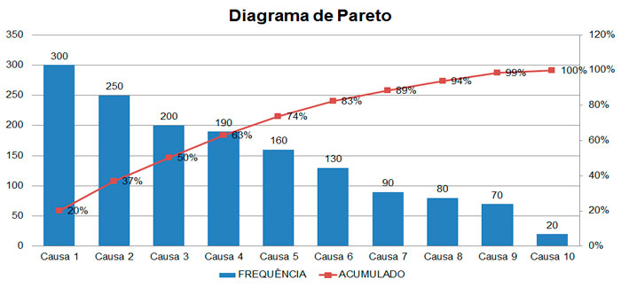
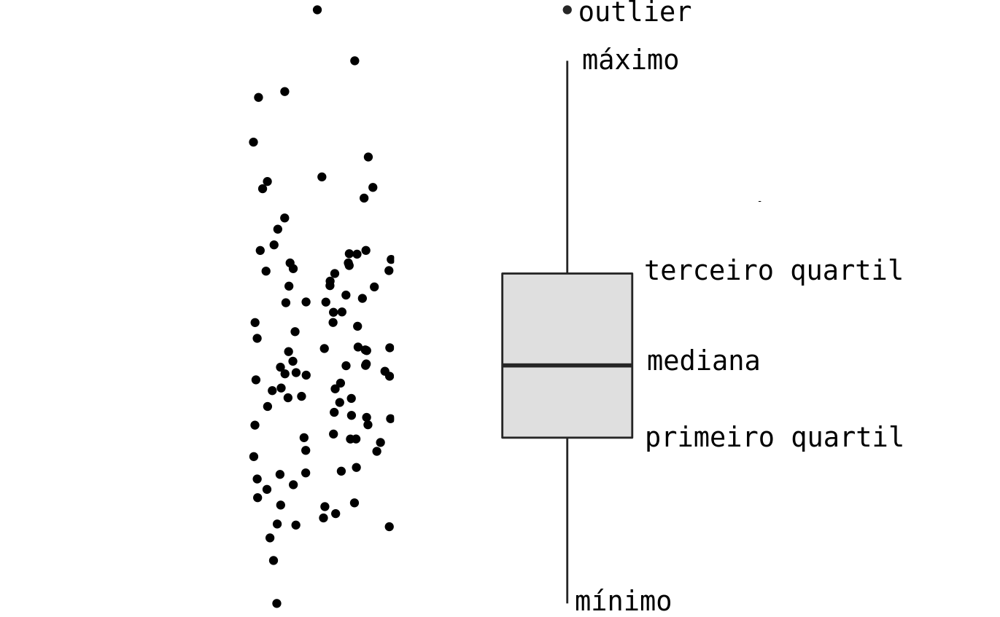
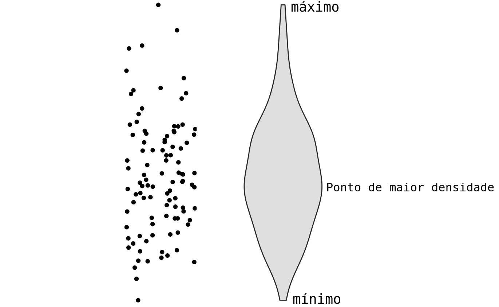
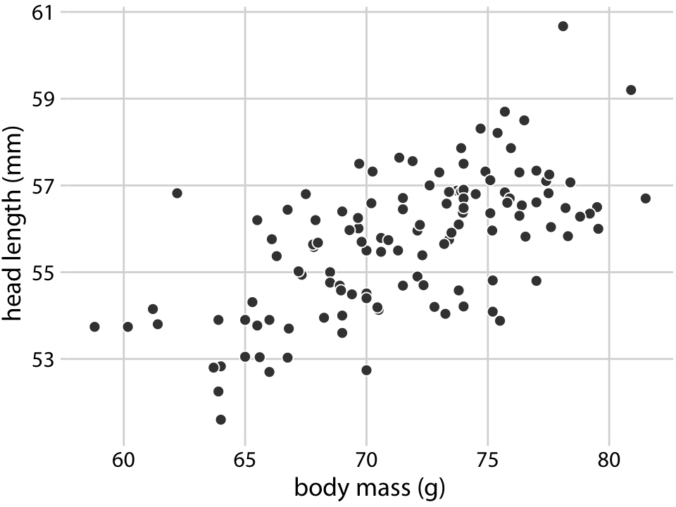

## Gráfico como Ferramenta de Decisão

Na Engenharia, o gráfico não é uma mera ilustração; é um instrumento de **diagnóstico** de processos e materiais.

1.  **DADO:** A leitura bruta (ex: 5.000 pontos de carga e extensão -- o quanto o material esticou).
2.  **INFORMAÇÃO:** O padrão visual (ex: a inclinação da reta indica o Módulo de Young -- rigidez/elasticidade do material).
3.  **DECISÃO:** A ação técnica (ex: "Este lote de polímero é adequado para a peça?").

> **Observação:** Não buscamos o gráfico mais "bonito", mas aquele que torna a falha (quebra do material) ou o sucesso evidente.

---

## Por que Visualizar Dados?

A representação gráfica permite extrair inteligência de grandes volumes de medições que seriam incompreensíveis em tabelas:

- **Identificar Padrões** (*Ex:* A relação entre temperatura e taxa de corrosão.)
- **Validar Expectativas:** Confirmar se o tratamento térmico atingiu a dureza esperada.
- **Descobrir Fenômenos:** Detectar anomalias ou falhas raras em lotes de produção.
- **Validar Estatísticas:** Verificar se a distribuição dos dados permite o uso de testes paramétricos (cálculos que exigem dados "normais").

---

## Ponto de Partida: O Tipo de Variável

- A escolha do gráfico não é estética, é técnica. A natureza dos dados define a visualização:
- Há então gráficos para
    - Variáveis Qualitativas (Categóricas)
    - Variáveis Quantitativas (Numéricas).

- O tipo de variável é que define as opções de gráficos que você pode utilizar.

---

## Requisitos de um Gráfico Técnico

Para que um gráfico sirva como prova técnica em um relatório de engenharia, ele deve conter:

- **Título Autoexplicativo:** Indica claramente o que foi medido.
- **Eixos Rotulados:** Nome da variável e sua unidade de medida (*Ex:* Tensão [MPa]).
- **Escala Sensata:** Evita distorções que mascarem a variação real.
- **Legenda Objetiva:** Diferencia as condições de ensaio ou materiais.

> **Atenção!** Um gráfico sem unidade (como MPa, °C ou mm) é inválido em um laudo técnico. Na dúvida, sempre pergunte: "Alguém conseguiria entender este gráfico sem eu precisar explicar?".

---

##

```{r}
#| echo: false
#| fig-align: center
#| layout-ncol: 2
#| fig-cap: 
#|   - "Gráfico ERRADO (Inaceitável)"
#|   - "Gráfico CERTO (Padrão Engenharia)"

library(ggplot2)

# Dados hipotéticos
set.seed(123)
dados_ensaio <- data.frame(
  Deformacao = seq(0, 0.2, length.out = 100),
  Aco_A = seq(0, 400, length.out = 100) + rnorm(100, 0, 5),
  Aco_B = seq(0, 550, length.out = 100) + rnorm(100, 0, 8)
)

# --- GRÁFICO ERRADO (Sem fontes e sem eixos) ---
grafico_errado <- ggplot(dados_ensaio) +
  geom_line(aes(x = Deformacao, y = Aco_A), size = 1.5) +
  geom_line(aes(x = Deformacao, y = Aco_B), size = 1.5, color = "blue") +
  coord_cartesian(ylim = c(300, 600)) + 
  theme_void() + 
  labs(title = "Gráfico 1") +
  theme(plot.title = element_text(size = 20, hjust = 0.5))

# --- GRÁFICO CERTO (Fontes grandes e legíveis) ---
grafico_certo <- ggplot(dados_ensaio) +
  geom_line(aes(x = Deformacao, y = Aco_A, color = "Aço 1020 (Recozido)"), size = 1.5) +
  geom_line(aes(x = Deformacao, y = Aco_B, color = "Aço 4340 (Temperado)"), size = 1.5) +
  scale_color_manual(values = c("black", "red")) +
  # base_size = 18 aumenta todos os textos do gráfico proporcionalmente
  theme_bw(base_size = 18) + 
  labs(
    title = "Curva Tensão-Deformação",
    x = "Deformação Unitária [mm/mm]",
    y = "Tensão Escoamento [MPa]",
    color = "Material"
  ) +
  theme(
    legend.position = "bottom",
    legend.text = element_text(size = 14),
    plot.title = element_text(face = "bold", size = 20),
    axis.title = element_text(face = "bold")
  )

# Renderizando
grafico_errado
grafico_certo
```


# Variáveis Qualitativas (Categóricas)

---

## Visualização de Dados Categóricos

- Quando os dados representam grupos ou nomes (Qualitativos), o objetivo da visualização é comparar a frequência ou a proporção entre categorias.
- As principais escolhas são:
    - **Gráfico de Barras:** Para comparar magnitudes.
    - **Gráfico de Barras Empilhadas:** Para comparar subgrupos dentro de categorias.
    - **Gráfico de Pareto:** Para priorização de problemas.
    - **Gráfico de Setores (Pizza):** Para mostrar partes de um todo.
    
---

## Gráfico de Barras

É a forma mais eficiente de comparar quantidades entre diferentes grupos (categorias).

- Como Construir:
    - **Eixo X (Categorias):** Espaçamento igual entre as barras.
    - **Eixo Y (Frequência):** Deve sempre começar no zero.
    - **Largura das Barras:** Deve ser constante para não sugerir "peso" diferente.
    - **Ordenação:** Se não houver ordem natural, organize de forma decrescente.

---

## 

### Exemplo: Identificação de Falhas Críticas

Considere a contagem de defeitos encontrados em uma inspeção de 500 componentes poliméricos.

| Categoria de Defeito | Ocorrências | Impacto |
|----------------------|------------:|:--------|
| Bolhas (Vazios)      | 145         | Crítico |
| Delaminação          | 52          | Crítico |
| Rebarbas             | 30          | Estético |
| Manchas              | 12          | Estético |
Fonte: Dados fictícios (2026).


## 

### Exemplo: Identificação de Falhas Críticas

O gráfico abaixo responde: "Qual processo de fabricação deve ser ajustado primeiro?"

```{r}
#| echo: false
#| eval: true
#| warning: false
#| fig-align: center
#| out-width: 100%

library(tidyverse)

bd <- tibble(
  Defeito = c("Vazios", "Delaminação", "Rebarbas", "Manchas", "Inclusões", "Trincas"),
  Contagem = c(145, 52, 30, 22, 15, 8)
)

ggplot(bd, aes(x = reorder(Defeito, -Contagem), y = Contagem)) +
  geom_bar(stat = "identity", fill = "#2c3e50", width = 0.7) +
  labs(title = "Distribuição de Não-Conformidades por Tipo",
       x = "Tipo de Defeito",
       y = "Frequência (Nº de peças)") +
  theme_minimal(base_size = 20)
```

- **Insight:** O excesso de "Vazios" sugere falha no sistema de vácuo ou na viscosidade da resina.

---

##

### Regras de Construção e Escala

O gráfico de barras é a escolha padrão para representar a magnitude de variáveis categóricas (nominais ou ordinais).

- **Aplicação:** Comparar quantidades entre grupos independentes.
- **Construção:**
    - O eixo das categorias não possui escala métrica (é uma lista).
    - O eixo quantitativo deve sempre começar no zero para não distorcer as proporções.
- **Interpretação:**
    - A altura (ou comprimento) da barra é proporcional ao valor que ela representa.
    - **Ordenação:** Salvo se houver uma ordem natural (ex: meses), as barras devem estar em ordem decrescente para facilitar a comparação visual imediata.

---

##

- Quando os rótulos das categorias são longos ou numerosos, a rotação facilita a leitura sem poluir o eixo horizontal.

```{r}
#| echo: false
#| eval: true
#| warning: false
#| fig-align: center
#| out-width: 100%

ggplot(bd, aes(y = reorder(Defeito, Contagem), x = Contagem)) +
  geom_bar(stat = "identity", fill = "#2c3e50", width = 0.7) +
  labs(title = "Visualização Rotacionada para Rótulos Extensos",
       x = "Frequência (Peças)",
       y = NULL) +
  theme_minimal(base_size = 20) +
  theme(
    panel.grid.major.x = element_line(color = "gray80", linewidth = 0.5),
    panel.grid.major.y = element_blank()
  )
```

---

## 

### Respeitando a Hierarquia dos Dados

- Ao contrário das variáveis nominais (onde ordenamos por frequência), variáveis ordinais possuem uma hierarquia intrínseca. **O gráfico deve preservar a ordem natural**, mesmo que a frequência não seja decrescente.
- **Exemplo:** Grau de Severidade de Desgaste em ferramentas de corte.

```{r}
#| echo: false
#| eval: true
#| warning: false
#| fig-align: center
#| out-width: 100%

ordem_severidade <- c("Inexistente", "Leve", "Moderado", "Severo", "Crítico")

dados_ordinais <- tibble(
  Severidade = factor(c("Inexistente", "Leve", "Moderado", "Severo", "Crítico"), 
                      levels = ordem_severidade),
  Frequencia = c(10, 45, 80, 25, 15)
)

ggplot(dados_ordinais, aes(x = Severidade, y = Frequencia)) +
  geom_bar(stat = "identity", fill = "#2c3e50", width = 0.7) +
  labs(title = "Análise de Desgaste (Variável Ordinal)",
       x = "Grau de Severidade",
       y = "Quantidade de Peças") +
  theme_minimal(base_size = 20)
```

---

## 

### Comparação entre grupos

**Problema:** Como diferentes fornecedores se comportam em diferentes ensaios?

```{r}
#| echo: false
#| fig-align: center

resistencia <- tibble(
  Ensaio = rep(c("Tração", "Compressão", "Cizalhamento"), 2),
  Fornecedor = c(rep("Fornecedor A", 3), rep("Fornecedor B", 3)),
  Valor = c(450, 600, 320, 420, 580, 400)
)

ggplot(resistencia, aes(x = Ensaio, y = Valor, fill = Fornecedor)) +
  geom_bar(stat = "identity", position = position_dodge()) +
  scale_fill_manual(values = c("#002060", "#60A0D0")) +
  labs(title = "Comparação de Resistência por Fornecedor",
       y = "Resistência (MPa)") +
  theme_minimal(base_size = 20)
```

---

##

### Barras empilhadas

- Cada segmento corresponde a uma subcategoria.
- A altura total da barra representa a soma de todas as subcategorias.
- Permite observar simultaneamente o total de cada categoria e a sua composição interna.

```{r}
#| echo: false
#| eval: true
#| warning: false
#| fig-align: center
#| out-width: 100%

library(tidyverse)

dados_materiais <- tibble(
  Material = rep(c("Polímero A", "Liga de Al", "Cerâmica X", "Compósito Z"), each = 2),
  Status = rep(c("Reprovado", "Aprovado"), 4),
  Quantidade = c(15, 85, 8, 92, 25, 75, 12, 88) # Valores simulados
)

ggplot(dados_materiais, aes(x = Material, y = Quantidade, fill = Status)) +
  geom_bar(stat = "identity", position = "stack") +
  geom_text(aes(label = Quantidade), 
            position = position_stack(vjust = 0.5), 
            color = "white", size = 5, fontface = "bold") +
  scale_fill_manual(values = c("#27ae60", "#e74c3c")) +
  labs(title = "Rendimento de Produção por Tipo de Material",
       x = "Material Analisado", 
       y = "Total de Peças Produzidas", 
       fill = "Resultado do Teste") +
  theme_minimal(base_size = 20)
```

- **Interpretação:** A Cerâmica X possui o maior índice de reprovação (25 peças), indicando que o processo de sinterização precisa de ajustes.

---

## Gráfico de Pareto

O Gráfico de Pareto é um gráfico de barras decrescentes com uma linha de frequência acumulada sobreposta.

- **Ideia:** 20% das causes geram 80% dos defeitos (regra dos 80/20).
- Este gráfico indica onde o esforço de engenharia terá o maior retorno financeiro e de qualidade.

- Como ele é estruturado:
    - **Barras (em ordem decrescente):** frequência ou quantidade de ocorrências
    - **Linha acumulada:** soma percentual dos problemas
    - **Dois eixos Y:**
        - esquerdo → quantidade
        - direito → porcentagem

---

##



---

## Exemplo

Um engenheiro de materiais catalogou as causas de descarte de 250 peças de alumínio em uma semana. O objetivo é reduzir a perda de material.

```{r}
#| echo: false
#| eval: true
#| warning: false
#| fig-align: center
#| out-width: 100%

library(tidyverse)

# Dados de defeitos em fundição
dados_pareto <- tibble(
  Defeito = c("Porosidade", "Inclusão", "Trinca", "Rebarba", "Desencontro", "Outros"),
  Frequencia = c(120, 75, 30, 15, 7, 3)
) %>%
  mutate(
    Defeito = factor(Defeito, levels = Defeito),
    Acumulado = cumsum(Frequencia),
    Perc_Acum = (Acumulado / sum(Frequencia)) * 100
  )

# Fator de escala para sincronizar os dois eixos
# O 100% do eixo direito deve ser igual à soma total das frequências no eixo esquerdo
soma_total <- sum(dados_pareto$Frequencia)
fator_escala <- soma_total / 100

ggplot(dados_pareto, aes(x = Defeito)) +
  # Barras (Eixo esquerdo)
  geom_bar(aes(y = Frequencia), stat = "identity", fill = "#2c3e50") +
  # Linha de Pareto (Eixo direito, mas mapeada para a escala do esquerdo)
  geom_line(aes(y = Perc_Acum * fator_escala, group = 1), color = "red", size = 1.2) +
  geom_point(aes(y = Perc_Acum * fator_escala), color = "red", size = 3) +
  # Configuração dos Eixos
  scale_y_continuous(
    name = "Frequência (Nº de peças)",
    limits = c(0, soma_total), # Garante que o teto seja a soma total
    sec.axis = sec_axis(~ . / fator_escala, name = "Percentual Acumulado (%)")
  ) +
  labs(title = "Análise de Perdas por Defeito (Pareto)",
       x = "Tipo de Defeito") +
  theme_minimal(base_size = 20) +
  theme(
    axis.title.y.right = element_text(color = "red", face = "bold"),
    axis.text.y.right = element_text(color = "red"),
    axis.title.y.left = element_text(face = "bold"),
    plot.title = element_text(face = "bold", hjust = 0.5)
  )
```

**Insight:** Atacando apenas Porosidade (pequenos buracos/vazios no metal) e Inclusão (sujeira presa dentro do material), o engenheiro resolve quase 80% das falhas do setor.

---

## Gráfico de Setores (Pizza)

O gráfico de setores mostra a relação entre as partes e o todo. Embora popular, ele é frequentemente criticado na engenharia.

**Quando usar:**

- Poucas categorias (máximo 3 ou 4).
- Diferenças de magnitude muito óbvias.

**Por que evitar:**

- O olho humano tem dificuldade em comparar áreas e ângulos com precisão.
- É difícil ler rótulos em fatias muito pequenas.

**Alternativa:** Gráfico de barras (sempre mais preciso para comparação técnica).

---

## 

### Exemplo

Neste caso, o gráfico de setores funciona porque as categorias são poucas e as diferenças são grandes.

```{r}
#| echo: false
#| eval: true
#| warning: false
#| fig-align: center
#| out-width: 90% # Ajuste leve para caber melhor no slide

library(tidyverse)

# Dados de custo
custo_composito <- tibble(
  Item = c("Fibra de Carbono", "Resina Epóxi", "Mão de Obra", "Energia"),
  Valor = c(60, 25, 10, 5)
)

# Definindo uma paleta de cores fortes e contrastantes para projeção
# Vermelho, Azul, Amarelo Ouro, Verde Escuro
cores_fortes <- c("#D55E00", "#0072B2", "#F0E442", "#009E73")

ggplot(custo_composito, aes(x = "", y = Valor, fill = Item)) +
  geom_bar(stat = "identity", width = 1, color = "white", size = 1.5) + # Borda branca grossa para separação
  coord_polar("y", start = 0) +
  theme_void(base_size = 22) + # Fonte maior para o título
  scale_fill_manual(values = cores_fortes) + # Aplicação das cores fortes
  labs(title = "Distribuição de Custos: Placa de Compósito",
       fill = "Componente:") +
  geom_text(aes(label = paste0(Valor, "%")), 
            position = position_stack(vjust = 0.5), 
            size = 8, # Texto dentro da fatia maior e em negrito
            fontface = "bold",
            color = "black") + # Texto preto para contraste no fundo colorido
  theme(
    plot.title = element_text(face = "bold", hjust = 0.5, size = 26),
    legend.text = element_text(size = 18),
    legend.title = element_text(size = 18, face = "bold")
  )
```

**Dica:** Se você precisar de números escritos dentro da fatia para que o gráfico seja entendido, um gráfico de barras provavelmente seria melhor.


# Variáveis Quantitativas (Numéricas)

---

## Visualização de Dados Numéricos

Quando os dados representam medidas ou contagens (Quantitativos), o objetivo é entender a distribuição, a variabilidade ou a relação entre variáveis. As principais escolhas são:

- **Histograma:** Mostra a distribuição dos dados.
- **Gráfico de Densidade:** Versão "suavizada" do histograma.
- **Boxplot:** Resume estatísticas e identifica *outliers* (dados muito fora do normal).
- **Gráfico de Violino:** Une boxplot com densidade.
- **Gráfico de Dispersão:** Avalia relação entre duas medidas (Ex: Temperatura vs. Dureza).
- **Gráfico de Linha:** Para séries temporais (dados medidos ao longo do tempo).

---

## Histograma

- É a ferramenta principal para visualizar a distribuição de uma variável quantitativa contínua.
- Ele mostra  frequência com que valores ocorrem em determinados intervalos (*bins*).
- Formatação:
    - *Eixo X:* Escala numérica contínua dividida em intervalos iguais.
    - *Eixo Y:* Frequência absoluta ou relativa.
    - *Barras Adjacentes:* Diferente do gráfico de barras, as barras do histograma são encostadas para indicar a continuidade dos dados.
    - *Objetivo:* Identificar o centro, a dispersão e o formato (simetria) dos dados.

---

## 

### Exemplo

Imagine que medimos a dureza de 100 amostras de um lote de aço. O gráfico nos diz se o processo de fabricação está estável ou se há muita variação.

```{r}
#| echo: false
#| eval: true
#| warning: false
#| fig-align: center
#| out-width: 100%

# 1. Simulando dados de dureza Rockwell (HRC)
set.seed(42)
dureza_vetor <- rnorm(100, mean = 45, sd = 1.5)

# 2. Criando o objeto de histograma do R base para extrair os breaks
h <- hist(dureza_vetor, plot = FALSE)

# 3. Usando os breaks calculados pelo R base dentro do ggplot2
library(ggplot2)
library(tibble)

ggplot(tibble(valor = dureza_vetor), aes(x = valor)) +
  geom_histogram(breaks = h$breaks, fill = "#2c3e50", color = "white") +
  scale_x_continuous(breaks = h$breaks) + 
  labs(
    x = "Dureza [HRC] (Limites exatos das classes)",
    y = "Frequência (Nº de Amostras)"
  ) +
  theme_minimal(base_size = 20) +
  theme(
    plot.title = element_text(face = "bold", hjust = 0.5),
    axis.text.x = element_text(angle = 0, vjust = 1, hjust = 1),
    axis.title = element_text(face = "bold")
  )
```

---

##

- O histograma é a representação gráfica de uma Tabela de Distribuição de Frequências por Classes.
- Para as 100 amostras de aço, teríamos a seguinte tabela.

| Dureza (HRC) | Freq. Absoluta |
|--------------------|---------------:|
| $40 \vdash 41$ | 1 |
| $41 \vdash 42$ | 3 |
| $42 \vdash 43$ | 6 |
| $43 \vdash 44$ | 14 |
| $44 \vdash 45$ | 22 |
| $45 \vdash 46$ | 29 |
| $46 \vdash 47$ | 14 |
| $47 \vdash 48$ | 9 |
| $48 \vdash 49$ | 2 |

---

## Gráfico de densidade

O gráfico de densidade é uma versão suavizada do histograma.

- **Como é feito:** Utiliza uma técnica matemática chamada *Kernel Density Estimation* (KDE) para criar uma linha contínua que estima a probabilidade de um valor ocorrer.
- **Interpretação:**
    - A área total sob a curva é igual a 1.
    - Picos indicam onde os dados estão mais concentrados.
    - Útil para comparar distribuições de grupos diferentes sem a poluição visual de muitas barras sobrepostas.

---

## 

Utilizando os mesmos dados de do lote de aço:

```{r}
#| echo: false
#| eval: true
#| warning: false
#| fig-align: center
#| out-width: 100%

library(ggplot2)

# Simulando dados de dureza (HRC)
set.seed(42)
dados_aco <- data.frame(dureza = rnorm(1000, mean = 45, sd = 1.5))

ggplot(dados_aco, aes(x = dureza)) +
  # O uso de aes(y = after_stat(density)) sincroniza a escala do histograma com a da densidade
  geom_histogram(aes(y = after_stat(density)), 
                 bins = 25, 
                 fill = "#0072B2", 
                 color = "white", 
                 alpha = 0.5) +
  geom_density(color = "#0072B2", linewidth = 1.5) +
  labs(title = "Distribuição de Dureza: Histograma + Densidade",
       x = "Dureza Rockwell [HRC]", 
       y = "Densidade de Probabilidade") +
  theme_minimal(base_size = 20) +
  theme(
    plot.title = element_text(face = "bold", hjust = 0.5),
    axis.title = element_text(face = "bold")
  )
```

---

## Boxplot

- Boxplot, ou diagrama de caixa, é um gráfico que divide os dados em quartis e é a melhor ferramenta para identificar a variabilidade de um material.

- Ele exibe cinco estatísticas principais:



---

## 

### Exemplo

Utilizando os mesmos dados de do lote de aço:

```{r}
#| echo: false
#| eval: true
#| warning: false
#| fig-align: center
#| out-width: 100%

ggplot(dados_aco, aes(y = dureza, x = "")) +
  # Preenchimento escuro (mesmo do histograma) e borda branca para os outliers
  stat_boxplot(geom = "errorbar", width = 0.2, size = 1.2) +
  geom_boxplot(fill = "#0072B2", 
               color = "black", 
               outlier.colour = "#D55E00", # Cor da linha de densidade para os outliers
               outlier.size = 3,
               width = 0.5) +
  labs(title = "Distribuição de Dureza (Boxplot)",
       x = "Lote de Produção", 
       y = "Dureza Rockwell [HRC]") +
  theme_minimal(base_size = 20) +
  theme(
    plot.title = element_text(face = "bold", hjust = 0.5),
    axis.title = element_text(face = "bold")
  )
```

---

##

O gráfico de boxplot é a útil para comparar a estabilidade de processos.


```{r}
#| echo: false
#| eval: true
#| warning: false
#| fig-align: center
#| out-width: 100%

library(ggplot2)

# Simulando dois lotes com comportamentos diferentes
set.seed(42)
lote_a <- data.frame(Dureza = rnorm(100, mean = 45, sd = 1.0), Lote = "Lote A (Estável)")
lote_b <- data.frame(Dureza = c(rnorm(100, mean = 44, sd = 2.5), 35, 36, 55), Lote = "Lote B (Instável)")

dados_comparativos <- rbind(lote_a, lote_b)

ggplot(dados_comparativos, aes(x = Lote, y = Dureza, fill = Lote)) +
  # Linhas de erro (máximo e mínimo) para contraste no projetor
  stat_boxplot(geom = "errorbar", width = 0.2, size = 1) +
  geom_boxplot(color = "black", 
               size = 1, 
               outlier.colour = "#D55E00", # Vermelho forte para destacar falhas
               outlier.size = 4,
               width = 0.6) +
  # Cores de alto contraste: Azul e Cinza Escuro
  scale_fill_manual(values = c("#0072B2", "#566573")) +
  labs(title = "Comparativo de Dureza: Estabilidade de Processo",
       x = "Lotes de Aço Analisados", 
       y = "Dureza Rockwell [HRC]") +
  theme_bw(base_size = 22) + # Fundo branco para projetor
  theme(
    legend.position = "none",
    plot.title = element_text(face = "bold", hjust = 0.5, size = 26),
    axis.title = element_text(face = "bold"),
    axis.text = element_text(color = "black", face = "bold"),
    panel.grid.major = element_line(color = "gray90")
  )
```

---

## Gráfico de Violino

- Combina um boxplot com uma estimativa de densidade de kernel.
- Quanto mais largo o violino em um determinado ponto, maior a concentração de dados naquele valor.



---

##

### Exemplo

Utilizando os mesmos dados de do lote de aço:

```{r}
#| echo: false
#| eval: true
#| warning: false
#| fig-align: center
#| out-width: 100%

ggplot(dados_aco, aes(y = dureza, x = "")) +
  # Preenchimento escuro (mesmo do histograma) e borda branca para os outliers
  geom_violin(fill = "#0072B2", color = "black", size = 1, alpha = 0.8) +
  labs(title = "Distribuição de Dureza",
       x = "Lote de Produção", 
       y = "Dureza Rockwell [HRC]") +
  theme_minimal(base_size = 20) +
  theme(
    plot.title = element_text(face = "bold", hjust = 0.5),
    axis.title = element_text(face = "bold")
  )
```

---

##

O gráfico de violino também serve para comprar grupos.

```{r}
#| echo: false
#| eval: true
#| warning: false
#| fig-align: center
#| out-width: 100%

library(ggplot2)

# Simulando dois lotes com comportamentos diferentes
set.seed(42)
lote_a <- data.frame(Dureza = rnorm(100, mean = 45, sd = 1.0), Lote = "Lote A (Estável)")
lote_b <- data.frame(Dureza = c(rnorm(100, mean = 44, sd = 2.5), 35, 36, 55), Lote = "Lote B (Instável)")

dados_comparativos <- rbind(lote_a, lote_b)

ggplot(dados_comparativos, aes(x = Lote, y = Dureza, fill = Lote)) +
  geom_violin(color = "black", size = 1, alpha = 0.8) +
  scale_fill_manual(values = c("#0072B2", "#566573")) +
  labs(title = "Comparativo de Lotes",
       x = "Status do Lote", 
       y = "Dureza Rockwell [HRC]") +
  theme_bw(base_size = 22) +
  theme(
    legend.position = "none",
    plot.title = element_text(face = "bold", hjust = 0.5, size = 26),
    axis.title = element_text(face = "bold"),
    axis.text = element_text(color = "black", face = "bold"),
    panel.grid.major = element_line(color = "gray90")
  )
```

---

## Visualização de Associações

### Gráfico de dispersão

- Serve para visualização de duas variáveis ao mesmo tempo.
- Auxilia a compreensão da relação entre variáveis.

{width=50%}

Tamanho da cabeça de uma espécie de pássaro e sua massa corporal.


## Visualização de Associações

### Gráfico de Dispersão (Scatterplot)

O Gráfico de Dispersão é usado para visualizar duas variáveis numéricas ao mesmo tempo e descobrir relações de causa e efeito.

- Interpretação:
    - Pontos subindo: correlação positiva (correlação direta).
    - Pontos descendo: correlação negativa (correlação inversa).
    - Pontos sem padrão: dados não correlacionados.

---

##

### Exemplo

Queremos saber o que acontece com a dureza do aço 1045 à medida que aumentamos a temperatura do forno.

```{r}
#| echo: false
#| eval: true
#| warning: false
#| fig-align: center
#| out-width: 90%

library(ggplot2)

# Simulando dados: Temperatura vs Dureza (Correlação negativa)
set.seed(42)
temperatura <- runif(100, min = 200, max = 600)
# A dureza cai conforme a temperatura sobe, com um pouco de ruído (erro de medição)
dureza_1045 <- 65 - 0.05 * temperatura + rnorm(100, mean = 0, sd = 2)

dados_dispersao <- data.frame(Temperatura = temperatura, Dureza = dureza_1045)

ggplot(dados_dispersao, aes(x = Temperatura, y = Dureza)) +
  geom_point(color = "#2c3e50", size = 4, alpha = 0.8) + # Pontos grandes e escuros
  labs(title = "Efeito do Revenimento na Dureza (Aço 1045)",
       x = "Temperatura do Forno [°C]",
       y = "Dureza Rockwell [HRC]") +
  theme_bw(base_size = 22) +
  theme(
    plot.title = element_text(face = "bold", hjust = 0.5, size = 26),
    axis.title = element_text(face = "bold"),
    axis.text = element_text(color = "black", face = "bold"),
    panel.grid.major = element_line(color = "gray85")
  )
```


## Visualização de Dados no Tempo

### Gráfico de Linha (Série Temporal)

É a forma mais comum e eficaz de mostrar como uma variável física evolui ao longo do tempo.

- Diferente do Gráfico de Dispersão (pontos isolados), a linha indica continuidade.
- Ele mostra tendências, ciclos ou anomalias ao longo de um período.

---

##

### Exemplo: Ciclo Térmico de um Forno de Têmpera

Se plotarmos o sensor do forno apenas com pontos, nosso cérebro tem dificuldade em seguir o caminho do aquecimento. Quando conectamos com uma linha, a história do material fica óbvia.

::: {.columns}
::: {.column width="49%"}

```{r}
#| echo: false
#| eval: true
#| warning: false
#| fig-height: 6

library(ggplot2)

# Simulando o perfil de temperatura de um forno ao longo de 24 horas
set.seed(42)
tempo <- 0:24
# Aquecimento, patamar (soaking) e resfriamento
temp_ideal <- c(seq(25, 850, length.out=6), rep(850, 10), seq(850, 200, length.out=9))
temperatura <- temp_ideal + rnorm(25, mean = 0, sd = 15) # Adicionando ruído do sensor
dados_forno <- data.frame(Hora = tempo, Temperatura = temperatura)

# Gráfico 1: Apenas Pontos (Dispersão)
ggplot(dados_forno, aes(x = Hora, y = Temperatura)) +
  geom_point(size = 5, color = "#2c3e50") +
  labs(title = "Sensor (Apenas Pontos)",
       x = "Tempo [Horas]",
       y = "Temperatura [°C]") +
  theme_bw(base_size = 20) +
  theme(plot.title = element_text(face = "bold", hjust = 0.5),
        axis.title = element_text(face = "bold"))
```
:::

::: {.column width="49%"}

```{r}
#| echo: false
#| eval: true
#| warning: false
#| fig-height: 6

# Gráfico 2: Pontos conectados por Linha
ggplot(dados_forno, aes(x = Hora, y = Temperatura)) +
  geom_line(size = 1.5, color = "#D55E00") + # A linha vermelha/laranja remete ao calor
  geom_point(size = 5, color = "#2c3e50") +
  labs(title = "Evolução do Ciclo Térmico",
       x = "Tempo [Horas]",
       y = NULL) + # Remove o título do eixo Y para não ficar redundante na coluna
  theme_bw(base_size = 20) +
  theme(plot.title = element_text(face = "bold", hjust = 0.5),
        axis.title.x = element_text(face = "bold"),
        axis.text.y = element_blank(), # Limpa o eixo Y da direita para focar no formato
        axis.ticks.y = element_blank())
```
:::
:::

**Insight:** A linha nos permite ver claramente as três fases do tratamento: Aquecimento (subida), Patamar de Austenizacão (reta estável em 850°C) e Resfriamento (descida).


## Para saber mais


<https://clauswilke.com/dataviz/visualizing-trends.html>

# Fim