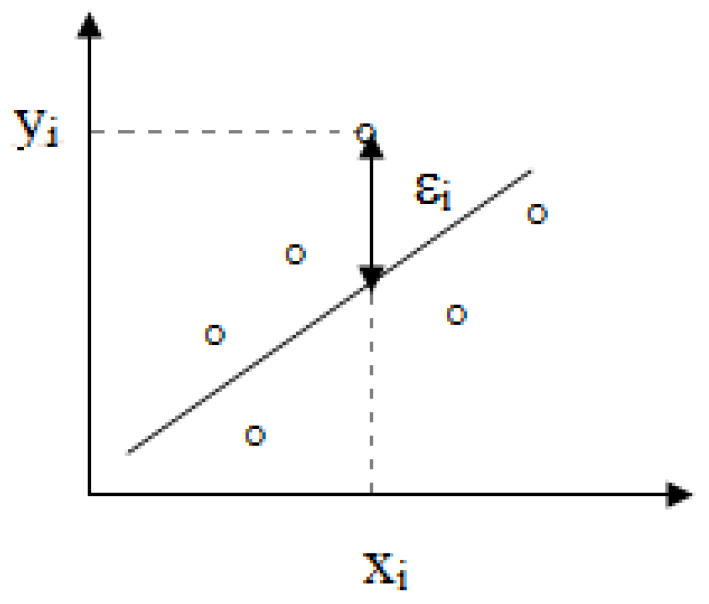
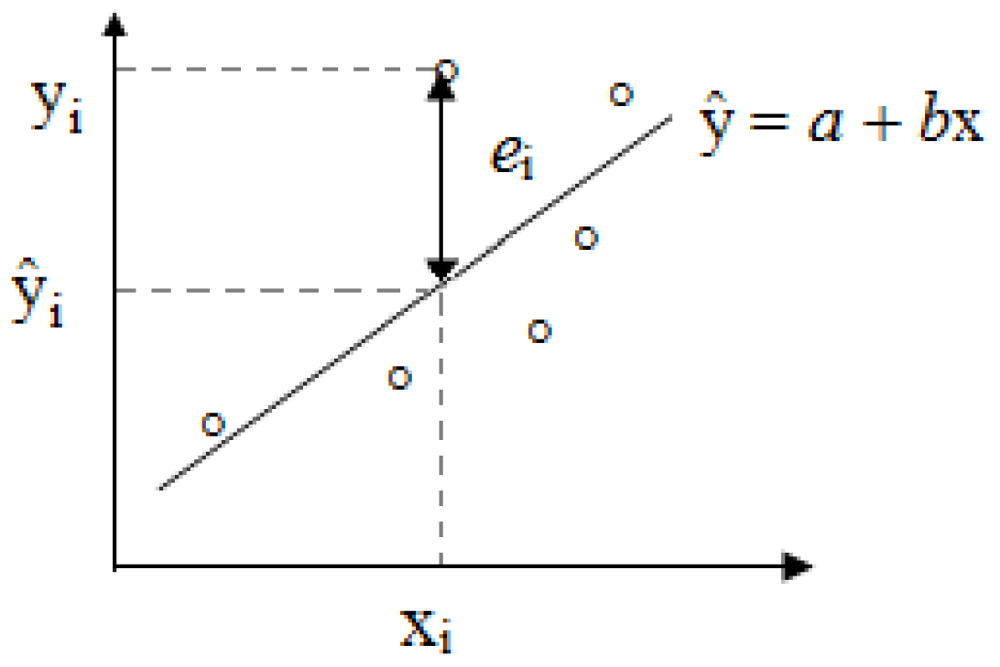

## Motivação

- Vamos estudar o modelo de regressão com a formulação: uma variável dependente $Y$ e uma variável independente $X$.
- O objetivo é modelar $Y$ como uma função linear de $X$: modelo de regressão linear simples.

| Área | Variável Independente ($X$) | Variável Dependente ($Y$) |
| :--- | :--- | :--- |
| **Eng. Materiais** | Carga aplicada (N) | Deformação do corpo de prova (mm) |
| **Eng. Civil** | Relação Água/Cimento | Resistência à Compressão (MPa) |
| **Física Médica** | Tempo de Exposição (s) | Dose de Radiação Absorvida (Gy) |

## Objetivos da Regressão Linear

- A regressão linear pode ser utilizada com dois objetivos principais:
  - **Modelo preditivo:** Estimar o valor de $Y$ para novos valores de $X$.
  - **Modelo Explicativo:** Investigar a relação entre as variáveis e entender como mudanças em $X$ influenciam $Y$.
- Nas engenharias, isso significa:
  - **Otimizar processos:** Encontrar o ajuste ideal de $X$ para obter o melhor $Y$.
  - **Reduzir custos e riscos:** Substituir medições complexas ou perigosas por estimativas matemáticas confiáveis baseadas em calibrações prévias.

## Fundamentos do Modelo

- A análise parte de pares $(x_1, y_1), (x_2,y_2),\ldots, (x_n,y_n)$.
- Suponha que podemos escrever a relação entre as duas variáveis, da seguinte maneira:

$$
y_i = \alpha + \beta x_i + \varepsilon_i
$$

- $y_i$ é a variável aleatória associada à $i$-ésima observação de $Y$;
- $x_i$ é a $i$-ésima observação do valor fixado para a variável independente (e não-aleatória) $X$;
- $\varepsilon_i$ é o erro aleatório da $i$-ésima observação, isto é, o efeito de uma infinidade de fatores que estão afetando a observação de $Y$ de forma aleatória;
- $\alpha$ e $\beta$ são parâmetros que precisam ser estimados.

## Estimando os Parâmetros

- Queremos encontrar a reta que passe o mais próximo possível dos pontos observados

## Estimando os Parâmetros

- O método de mínimos quadrados é usado para estimar os parâmetros do modelo ($\alpha$ e $\beta$) e consiste em fazer com que a soma dos erros quadráticos seja menor possível, ou seja, este método consiste em obter os valores de $\alpha$ e $\beta$ que minimizam a expressão:
$$
	S = \sum\limits_{i=1}^n \varepsilon_i = \sum\limits_{i=1}^n (y_i - \alpha - \beta x_i)^2.
$$

## Fórmulas das Estimativas

- Aplicando-se derivadas parciais à expressão anterior, e igualando-se a zero, acharemos as seguintes estimativas para $\alpha$ e $\beta$, as quais chamaremos de $a$ e $b$, respectivamente:
$$
	b = \frac{n \sum\limits_{i=1}^n x_i y_i - \left(  \sum\limits_{i=1}^n x_i\right) \left(  \sum\limits_{i=1}^n y_i\right)}{n\sum\limits_{i=1}^n x_i^2 - \left(\sum\limits_{i=1}^n x_i\right)^2}
$$
				e
$$
	a = \frac{\sum\limits_{i=1}^n y_i - b \sum\limits_{i=1}^n x_i}{n}.
$$

## A Reta de Regressão

- A chamada equação (reta) de regressão é dada por:
$$
	\widehat{y} = a + bx
$$
- E para cada valor $x_i$ ($i = 1, \ldots, n$) temos, pela equação de regressão, o valor predito:
$$
	\widehat{y}_i = a + b x_i.
$$
- A diferença entre os valores observados e os preditos é chamada de resíduo:
$$
	e_i = y_i - \widehat{y}_i.
$$

## Resíduos e Ajuste

- O resíduo relativo à $i$-ésima observação ($e_i$) pode ser considerado uma estimativa do erro aleatório ($\varepsilon_i$) desta observação (veja ilustração abaixo).

- Como medir a "qualidade" do modelo?

## Coeficiente de Determinação ($R^2$)

- O coeficiente de determinação é uma medida descritiva da proporção da variação de $Y$ que pode ser explicada por variações em $X$, segundo o modelo de regressão especificado. Ele é dado pela seguinte razão:

$$
  \begin{align}
		R^2 &= \frac{\text{variação explicada pelo modelo}}{\text{variação total}}\\
		  &=\frac{\sum\limits_{i=1}^n (\widehat{y}_i - \overline{y})^2}{\sum\limits_{i=1}^n (y_i - \overline{y})^2} = \frac{\sum\limits_{i=1}^n \widehat{y}_i - n\overline{y}^2}{\sum\limits_{i=1}^n y_i - n\overline{y}^2}.
	\end{align}
$$

## Coeficiente de Determinação ($R^2$)

- Note que $0\leq R^2 \leq 1$.

  - Se $R^2 = 0$, o modelo não tem nenhum poder explicativo.
  - Se $R^2 = 1$, o poder explicativo do modelo é total.

## Exemplo 6.1

Uma engenheira está desenvolvendo um novo polímero reforçado com fibras de vidro. Ele quer entender como o aumento do **percentual de fibra de vidro (em massa)** afeta a **resistência ao impacto** do material. Isso permite prever a resistência de novas composições e identificar o ponto onde o excesso de fibra pode, na verdade, fragilizar o material devido à má dispersão.

|  |  |  |  |  |  |  |  |
| :--- | :--- | :--- | :--- | :--- | :--- | :--- | :--- |
| Teor de Fibra (%) | 2 | 4 | 4 | 5 | 7 | 8 | 10 |
| Resistência (J) | 40 | 55 | 50 | 41 | 17 | 26 | 16 |

(a) Ajuste um modelo de regressão linear para prever a Resistência ($Y$) em função do Teor de Fibra ($X$).
(b) Calcule o Coeficiente de Determinação ($R^2$) e interprete a qualidade do ajuste.
(c) Estime qual seria a Resistência esperada para um composto com 12% de fibra.

## Exemplo 6.2

O engenheiro monitora a consistência do concreto via betoneira. Ele modela o **volume de água** (L/m³) e o **abatimento** (capacidade de fluir e nivelar sem compactação adicional) em centímetros. O objetivo é prever a fluidez, garantindo o preenchimento de armaduras densas sem criar vazios.

|  |  |  |  |  |  |  |  |
| :--- | :--- | :--- | :--- | :--- | :--- | :--- | :--- |
| Água adicionada (L/m³) | 160 | 165 | 165 | 170 | 175 | 180 | 185 |
| Abatimento (cm) | 5 | 8 | 7 | 10 | 14 | 18 | 22 |

- (a) Ajuste um modelo de regressão linear para prever o Abatimento ($Y$) com base na Água ($X$).
- (b) Interprete o significado prático do coeficiente $\beta_1$ (inclinação) para a dosagem do concreto.
- (c) Se o projeto exige um abatimento de 16 cm, quanta água o engenheiro deve estimar?

# Fim