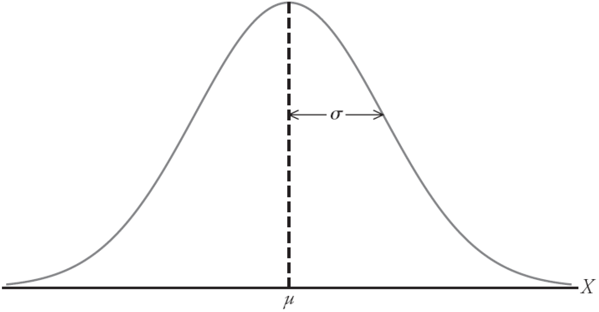
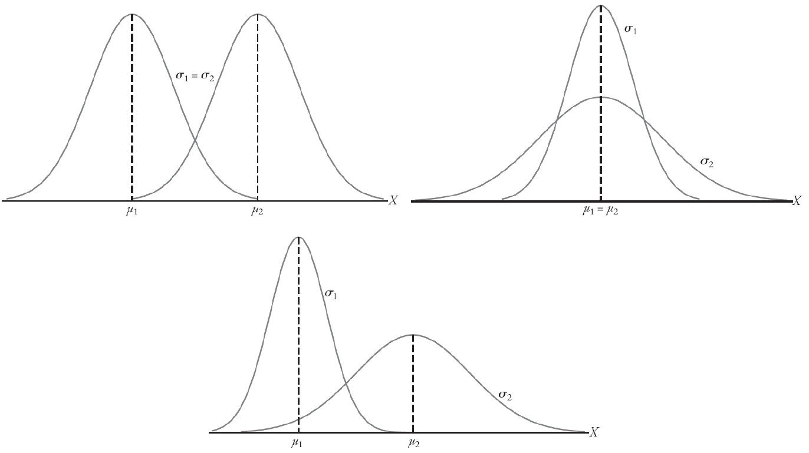
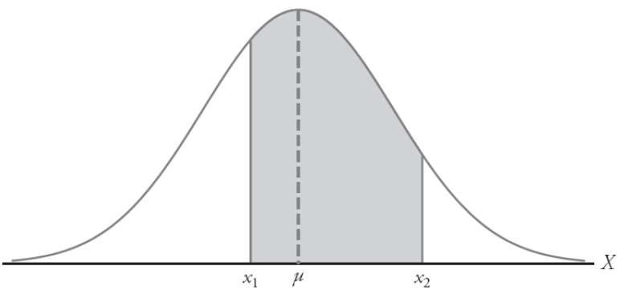
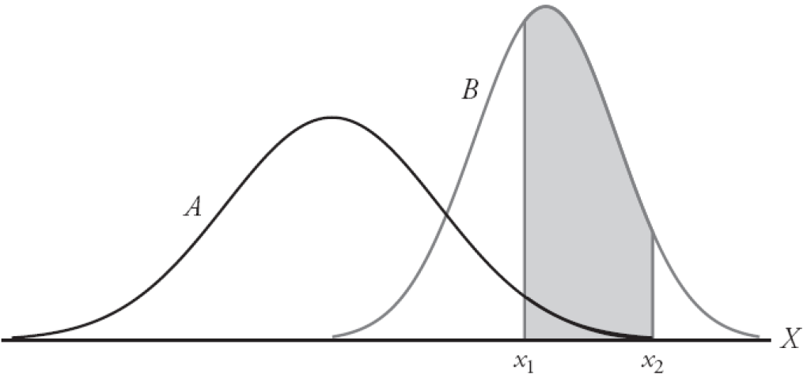

## Distribuição Normal

A densidade da variável aleatória normal $X$, com média $\mu$ e variância $\sigma^2$, é dada por
$$
	f(x) = \frac{1}{\sigma\sqrt{2\pi}} e^{-\frac{1}{2\sigma^2}(x-\mu)^2}, \quad -\infty<x<\infty,
$$
em que $\pi=3,14159\ldots$ e $e=2,717828\ldots$

- **Notação:** $X\sim N(\mu,\sigma^2)$.

##

##

- Uma vez que $\mu$ e $\sigma$ estão especificados, a curva normal está completamente determinada.

## Propriedades

- A moda, que é o ponto no eixo horizontal onde a curva é o máximo, ocorre em $x=\mu$.
- A curva é simétrica em torno do eixo vertical que passa na média $\mu$.
- A curva tem seus pontos de inflexão em $x = \mu\pm\sigma$, é côncava para baixo se $\mu-\sigma<X<\mu+\sigma$ e, caso contrário, é côncava para cima.
- A área total abaixo da curva e acima do eixo horizontal é igual a 1.

## 

- Para calcularmos a área abaixo da curva delimitadas pelas duas ordenadas $x = x_1$ e $x = x_2$ é igual a probabilidade de que a variável aleatória $X$ assuma um valor entre $x = x_1$ e $x = x_2$. Assim,
$$
	P(x_1<X<x_2) = \int\limits_{x_1}^{x_2} \frac{1}{\sigma\sqrt{2\pi}}e^{-\frac{1}{2\sigma^2}(x-\mu)^2} dx.
$$

{align="center"}

##

- Como diferentes valores de $\mu$ e $\sigma$ correspondem a diferentes curvas normais, a área debaixo da cuva entre duas ordenadas depende de $\mu$ e $\sigma$.

##

- A integral que corresponde à área sob a curva normal não tem forma fechada. Assim, as integrais são obtidas em forma de tabela.
-  Pra isso, transformamos as observações de qualquer variável aleatória normal $X$ em um novo grupo de observações da variável aleatória normal $Z$, com média 0 e variância 1, $Z \sim N(0, 1)$.
- A transformação é
$$
	Z = \frac{X-\mu}{\sigma}.
$$
- A distribuição de uma variável aleatória normal de média 0 e variância 1 é chamada de **distribuição normal padrão**.

## Usando a curva normal "ao contrário"

- Ocasionalmente, temos que encontrar o valor de $Z$ correspondente a uma probabilidade específica que está na tabela.
- Em alguns casos podemos estar interessados no valor de $X$. Para tanto, rearranjamos a fórmula
$$
  Z = \frac{X-\mu}{\sigma} \text{ para dar } X = \sigma Z+\mu.
$$

## Exemplo 12.1

Dada uma distribuição normal padrão, determine a área abaixo da curva que está

(a) à direita de $Z=1,84$;
(b) entre $Z=-1,97$ e $Z=0,86$.

## Exemplo 12.2

Dada uma distribuição normal padrão, determine o valor de $k$ de modo que

(a) $P(Z>k)=0,3015$;
(b) $P(k<Z<-0,18)=0,4197$.

## Exemplo 12.3

Dada uma distribuição normal com média $\mu=40$ e $\sigma=6$, determine o valor de $X$ que tem

(a) 45% da área à esquerda;
(b) 14% da área à direita.

## Exemplo 12.4

Uma indústria fabrica chapas metálicas cuja espessura deve permanecer entre $2{,}00 \pm 0{,}02$ mm. As espessuras seguem distribuição normal com média $\mu = 2{,}00$ mm e desvio-padrão $\sigma = 0{,}01$ mm.

a) Qual a proporção de chapas aprovadas no controle de qualidade?

b) Qual a probabilidade de uma chapa apresentar espessura inferior a 1,98 mm?

c) Qual deve ser o valor de $d$ para que 95% das chapas estejam entre $2{,}00 \pm d$ mm?

## Exemplo 12.5

Um laboratório mede a resistência de blocos de concreto utilizados em construção civil. Os resultados seguem distribuição normal com média de 40 MPa e desvio-padrão de 3 MPa.

a) Qual a probabilidade de um bloco apresentar resistência inferior a 36 MPa?

b) Qual a probabilidade de a resistência estar entre 38 MPa e 44 MPa?

c) Qual deve ser a resistência mínima para que apenas 5% dos blocos apresentem valores superiores a ela?

## Exemplo 12.6

Um pesquisador analisa o tempo gasto em exames de imagem. O tempo médio é de 25 minutos com desvio-padrão de 3 minutos.

a) Qual a probabilidade de um exame durar mais de 28 minutos?

b) Qual a probabilidade de um exame durar entre 22 e 27 minutos?

c) Apenas exames entre (25 \pm d) minutos são considerados dentro do padrão operacional. Determine (d) para que 95% dos exames estejam dentro da faixa normal.

## Exemplo 12.7

Um aplicativo móvel utiliza em média 250 MB de armazenamento com desvio-padrão de 15 MB.

a) Qual a porcentagem das instalações que ocupam mais de 280 MB?

b) Qual a probabilidade de uma instalação ocupar entre 235 MB e 260 MB?

c) Acima de qual valor estão os 12% maiores consumos de armazenamento?

# Fim