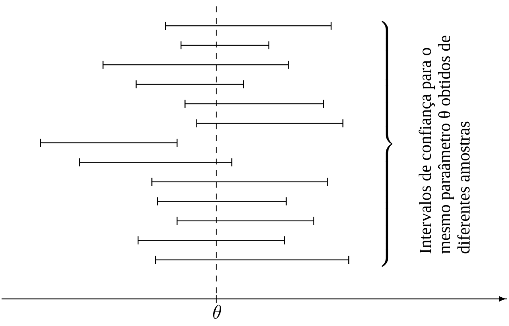
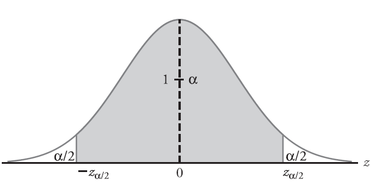
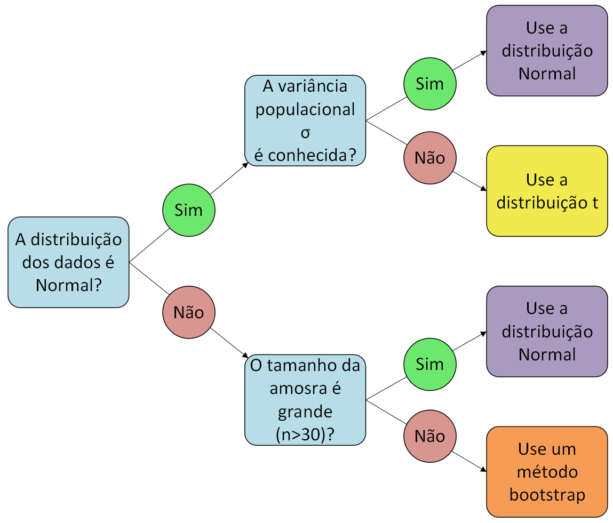

## Inferência Estatística

- Em geral, quando fazemos um estudo, coletamos dados de uma amostra para entender algo sobre uma população inteira.
- O processo de usar amostras para tirar conclusões sobre os parâmetros de populacionais é chamado de **inferência estatística**.
- A inferência estatística nos permite fazer generalizações sobre uma população com base em dados de uma amostra e se divide em duas áreas principais:
  1. Estimação (pontual e intervalar)
  2. Testes de hipóteses

## Estimação Pontual

- Suponha que queremos estimar a altura média dos alunos da UFS.
- Por questões de tempo e de custo, só conseguimos coletar uma amostra de 100 alunos.
  - A média que calcularmos a partir dessa amostra ($\overline{X}$) é uma estimativa para a média real da população ($\mu$).
  - Por causa do erro amostral, a média da amostra quase nunca é exatamente igual à média da população. Ela está perto, mas não é a mesma coisa.
- É aí que entram os **Intervalos de Confiança**.

## Intervalos de Confiança

- Intervalos de confiança são uma faixa de valores que "merece nossa confiança" para conter o valor real do parâmetro da população.
- **Definição formal:** Um intervalo $[a,b]$ é um intervalo de confiança $(1 - \alpha)\times 100\%$ para um parâmetro $\theta$ se a probabilidade desse intervalo conter $\theta$ for $1-\alpha$. Ou seja,
$$
  P(a\leq \theta \leq b) = 1-\alpha.
$$
- A probabilidade $1-\alpha$ é chamada de **nível de confiança**.
  - Os valores mais comuns são 90%, 95% e 99%.

## Intervalos de Confiança

- É importante entendermos o que é aleatório nessa equação. 
- O parâmetro da população, $\theta$, é um valor fixo. Ele não muda. O que é aleatório é o intervalo $[a,b]$, que é construído a partir de dados aleatórios da amostra.
- O nível de confiança de 95% significa que se pegarmos 100 amostras diferentes e construirmos 100 intervalos de confiança, esperamos que 95 desses intervalos contenham o valor real do parâmetro da população e 5 deles não contenham.

## Intervalos de Confiança

## Intervalos de Confiança para a Média

- Como construímos um intervalo de confiança para a média da população ($\mu$)?
- O ponto de partida é o estimador da média da população, que é a **média da amostra** ($\overline{X}$).
- A fórmula geral para um intervalo de confiança é:
$$
  \text{Centro} \pm \text{margem de erro}
$$
- Onde o centro é o estimador ($\theta$) e a margem de erro depende do nível de confiança e da variabilidade dos dados.

## Caso 1: A variância da população $(\sigma^2)$ é conhecida

Nesse caso, usamos a distribuição Normal padrão (Z). A fórmula é:
$$
  \overline{X} \pm z_{\alpha/2}\frac{\sigma}{\sqrt{n}}
$$ {#eq-ICvarConhecida}
em que 

  - $\overline{X}$ é a média da amostra
  - $z_{\alpha/2}$ é o valor crítico da distribuição Normal padrão que deixa uma área de $\alpha/2$ na cauda superior
  - $\sigma$ é o desvio padrão da população
  - $n$ é o tamanho da amostra

## Caso 1: A variância da população $(\sigma^2)$ é conhecida

##  Caso 1: A variância da população $(\sigma^2)$ é conhecida

- A @eq-ICvarConhecida funciona em duas situações:
  1. Quando a população de onde a amostra foi retirada já segue uma distribuição Normal.
  2. Quando o tamanho da amostra ($n$) é grande o suficiente, mesmo que a distribuição da população não seja Normal. Isso é graças a um resultado chamado *Teorema Central do Limite*.
     - Nesse caso, substituímos o desvio padrão populacional $\sigma$ na @eq-ICvarConhecida pelo desvio padrão amostral $S$.

## Exemplo 13.1

Construa um intervalo de confiança de 95% para a média da população com base em uma amostra de medições:

$$2.5\quad 7.4\quad 8.0\quad 4.5\quad 7.4\quad 9.2$$

se os erros de medição têm distribuição Normal e o dispositivo de medição garante um desvio padrão de $\sigma=2.2$.

## Exemplo 13.2
Uma equipe de engenheiros e físicos médicos está usando um scanner de raio-X industrial controlado por computador para avaliar a segurança dos pilares de concreto de uma ponte. O sistema mede o coeficiente de atenuação ($\mu$) do material, que indica o quanto o concreto barra a radiação. Um concreto saudável e seguro para essa ponte deve ter um coeficiente médio de, no mínimo, $0,210 \text{ cm}^{-1}$. Valores abaixo disso indicam que o concreto está poroso, com rachaduras internas ou falhas de fundação. Para testar a segurança, o computador realizou 64 medições em pontos aleatórios de um pilar, obtendo uma média amostral de $0,220 \text{ cm}^{-1}$ e desvio padrão de $0,040 \text{ cm}^{-1}$. Calcule o Intervalo de Confiança de 95% para a verdadeira média do coeficiente desse pilar e avalie se o pilar é seguro ou a ponte corre o risco de desabar.

## Como Obter o Tamanho da Amostra

- Usamos a margem de erro:

$$
  z_{\alpha/2}\frac{\sigma}{\sqrt{n}} \leq E
$$

- Ao rearranjar a fórmula para $n$, obtemos o tamanho de amostra mínimo necessário:
$$
  n \geq \left(\frac{z_{\alpha/2} \cdot \sigma}{E}\right)^2
$$

- Como o tamanho da amostra precisa ser um número inteiro, devemos sempre arredondar para cima para garantir que a margem de erro não exceda o valor desejado.

## Exemplo 13.3

No Exemplo 13.1, construímos um intervalo de confiança de 95% com centro 6.50 e margem de 1.76, baseado em uma amostra de tamanho 6. Agora, esse intervalo era muito amplo, certo? Qual o tamanho de amostra que precisamos para estimar a média da população com uma margem de no máximo 0.4 unidades e com 95% de confiança?

## Caso 2: A variância da população $(\sigma^2)$ é desconhecida

- Esse é o caso mais comum, pois geralmente não sabemos a variância da população. O que fazemos é usar o desvio padrão da amostra ($S$) para estimar o desvio padrão da população ($\sigma$).
- No entanto, essa substituição tem uma consequência importante: a distribuição do nosso estimador não é mais a Normal padrão (Z), mas sim a distribuição t de Student.

## Caso 2: A variância da população $(\sigma^2)$ é desconhecida

- A fórmula para o intervalo de confiança é:
$$
\overline{X}\pm t_{\alpha/2}\frac{S}{\sqrt{n}}
$$
  - $S$ é o desvio padrão da amostra
  - $t_{\alpha/2}$ é o valor crítico da distribuição t de Student com $n-1$ graus de liberdade.
  

## Caso 2: A variância da população $(\sigma^2)$ é desconhecida

- Graus de liberdade podem ser pensados como o número de observações independentes disponíveis para estimar a variabilidade. Aqui, perdemos um grau de liberdade porque usamos a média da amostra ($\overline{X}) para calcular o desvio padrão da amostra.
- Quando o tamanho da amostra ($n$) é grande, a distribuição t de Student se aproxima da distribuição Normal padrão. É por isso que, para grandes amostras, a gente pode usar a distribuição Z, mesmo com o desvio padrão da amostra.

## Exemplo 13.4

Alguns métodos buscam detectar intrusões em contas de computador, mesmo com a senha correta. A técnica mede padrões de digitação, como o tempo entre as teclas, e os compara com os do dono da conta. Se a diferença for significativa, um intruso é identificado. Os seguintes tempos (em segundos) entre as teclas foram registrados quando um usuário digitou o nome de usuário e a senha:

|     |     |     |     |     |     |     |     |     |
|----:|----:|----:|----:|----:|----:|----:|----:|----:|
| 0.24| 0.22| 0.26| 0.34| 0.35| 0.32| 0.33| 0.29| 0.19|
| 0.36| 0.30| 0.15| 0.17| 0.28| 0.38| 0.40| 0.37| 0.27|

Como primeiro passo para detectar uma intrusão, construa um intervalo de confiança de 99% para o tempo médio entre as teclas, assumindo uma distribuição Normal para esses tempos.

## Como Escolher o Intervalo de Confiança para a Média

  

# Fim